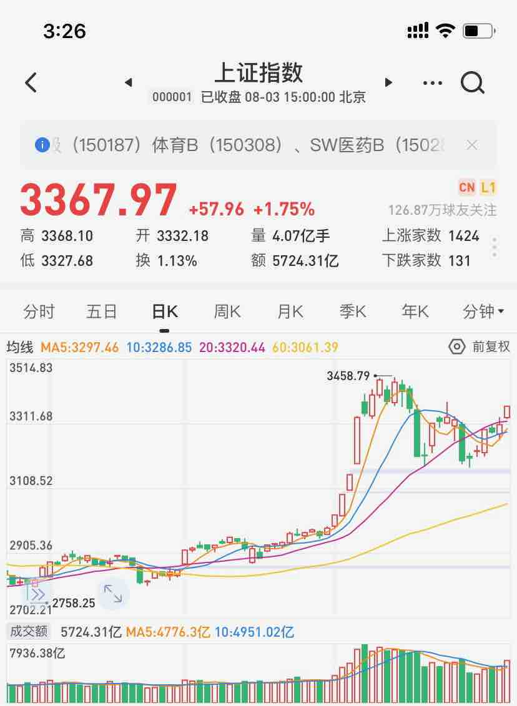
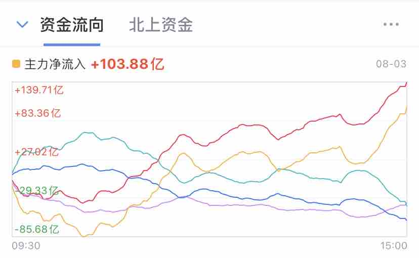
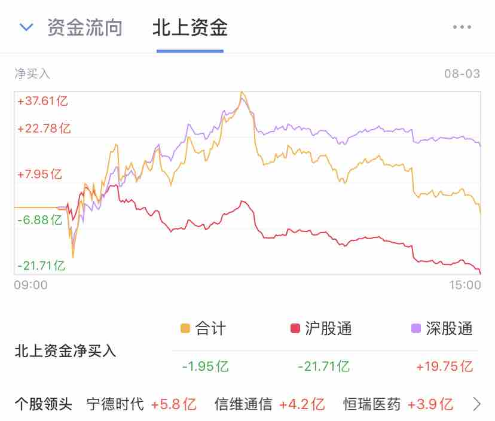

#! https://zhuanlan.zhihu.com/p/166462491
昨天的多空比是41:17，属于近期的明显偏多，同时sanhu仓位也上升到7月16日以来的高位，从上一交易日的72.85上升到73.6

股票型7月发了500多亿，混合型发了2000多，加起来应该可能有个3000亿左右 而对应的，6月份股票型是68亿，混合型是1200多，所以7月发的新基金发的确比较猛，**跌下来市场承接盘是有的,但不会主动拉大盘**。

今天策略：

* 不追高

## 复盘

赚钱效率不错，上涨：3665支  下跌：290支  平盘: 31支

主板突破 3356点，并且收盘稳定在上方，表现很好。

今天北向资金流出，大盘上涨，说明有增量资金入场，不过也要开始小心，需要开始逐步减仓。

主板交易额: 5724亿，还是不够大，如果明天没有继续放量，需要减仓，目前的量能无法突破更高的指数，会进行回调。

## 指数

