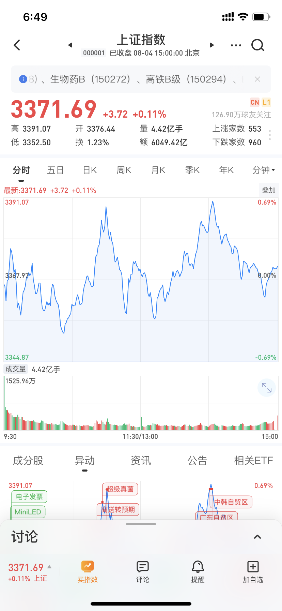
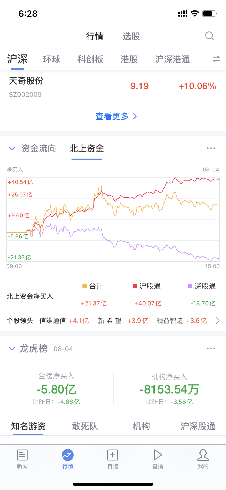
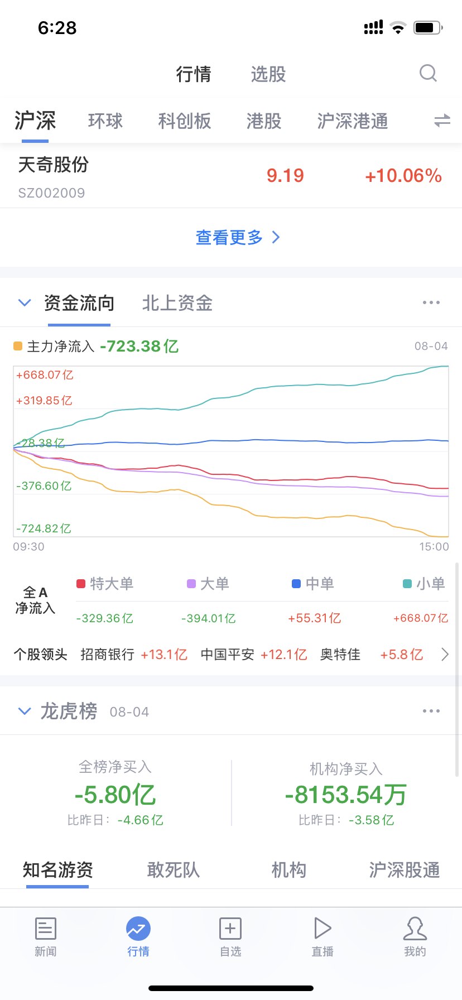

## 0804 总结

## 策略

昨天看多的人比较多，卫大指标：

* 多空比在37:22，连续第二天看多的人大幅度较多

* 散户仓位从前一天的73.6进一步上升到74.75

这是一个比较强的看空信号，今天高位可以减仓。

如果有大的黄金坑，人气低点，可以进行补仓，因为8月新发的基金比较多，要建仓。

## 个股

欧菲光：**分析错误**

* 昨天趋势不错，今天拿出部分仓位进行高抛低吸  

* 3号下午2点，主力大量买入，推动股票上涨，放量长阳线，今晚美股苹果大涨，明天继续加仓。

* 复盘

    * 失败的操作，加仓结果更低，
    * 更糟糕的是在低位割肉了，最低点割的，疼
    * 而且在KDJ线的底部卖的，太不冷静了，这其实是低位买点，冲动了

    

雅克科技：观望

* 第一天大涨后，如果是放量的股票，第二天可以跟进

## 主板总结

如果大盘是银行等蓝筹股拉盘，那就不是一个好事

