## 股票复盘

## 2020-07-20

成交量：4865亿 ->  5440 亿 `放`

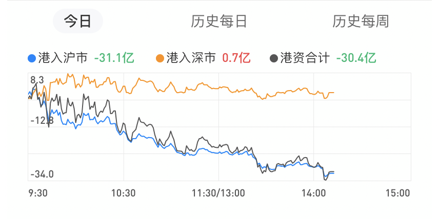

## 2020-07-21

成交量：5440 -> 5405亿 `缩`

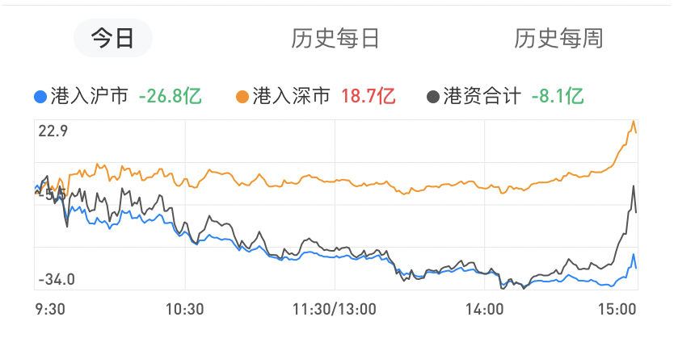

## 2020-07-22

成交量：4888-> 5405亿   `放`

复盘： 建仓吃药、喝酒、科技三个板块ETF

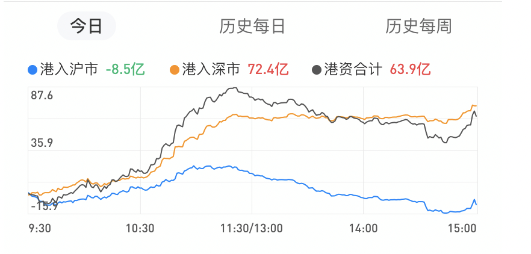

## 2020-07-23

成交量：5405  -> 5468 亿  `放`

事件：美国政府要求中国 72 小时内关闭驻休斯敦总领事馆（`美国目前对中国最大的利空不在这，而是再次加征关税问题。初次之外，没有什么消息可以阻止A股继续走牛的趋势`）

复盘: 主力又一次玩了一把完美洗盘，走V， 今天低点的时候应该低吸

策略: 下次如果资金流向，主力流出和小单流入量相近的时候，说明是主力在洗盘，可以在低点吸入

预测：明日冲高 3380点，如果失败减仓

总结：**即便后面大盘还要下去依然是假摔而已，这是主力的诱空手段，是要让散户割肉交出手里的筹码而已，大家要明白这里主力的手法与意图。**

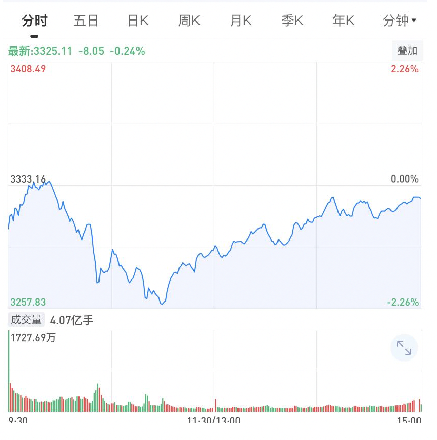

---

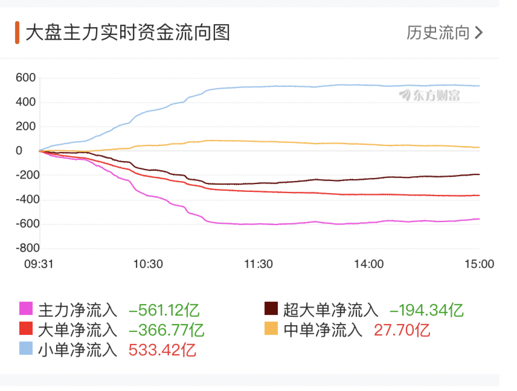

---

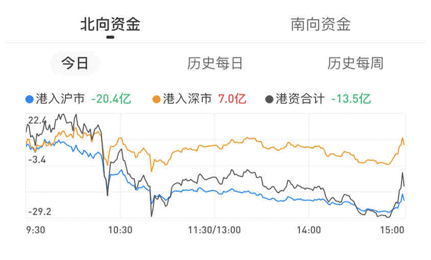

## 2020-07-24

成交量:  5468  ->  5843亿 `放`

选股：

* 酒鬼酒 000799   69.12 建， 跌破 65.86 减半  跌到：65.88
* 策略：极限 `3180-3250`，强势`3300`

复盘：

* 昨天大盘出现了深V，卫大说：**V了之后，都是看多的人会多一点。他印象中四次里面，三次后面都是凉了的**

预判: 

* 下周先跌，然后企稳，指数可以稳住后慢慢加仓

总结:

* 不能跟这市场节奏走，这样会被玩死，以后要设立自己的节奏。**不满仓，低位买进，高位卖出，保持仓位**

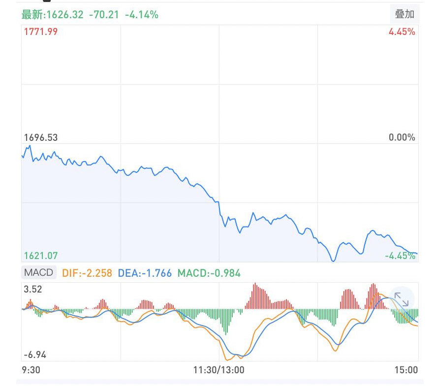

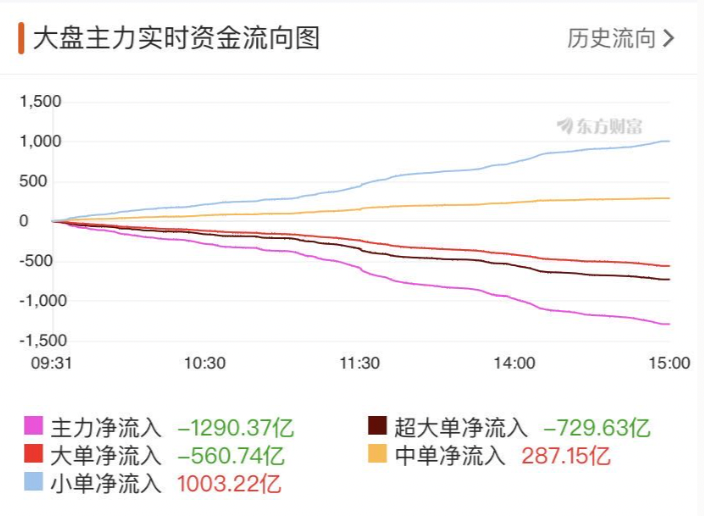

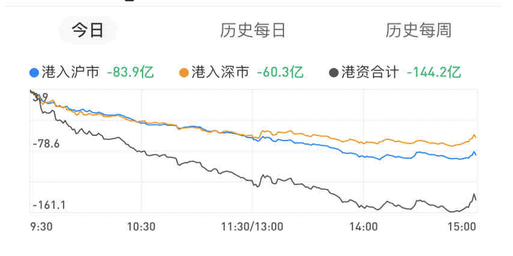

## 2020-07-27

成交量:   `缩`

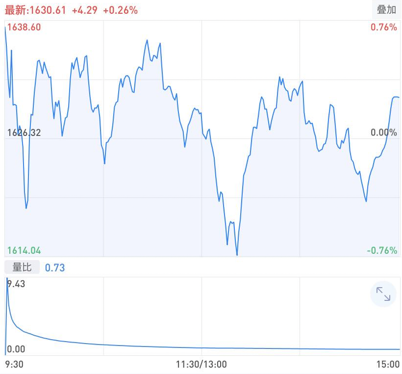

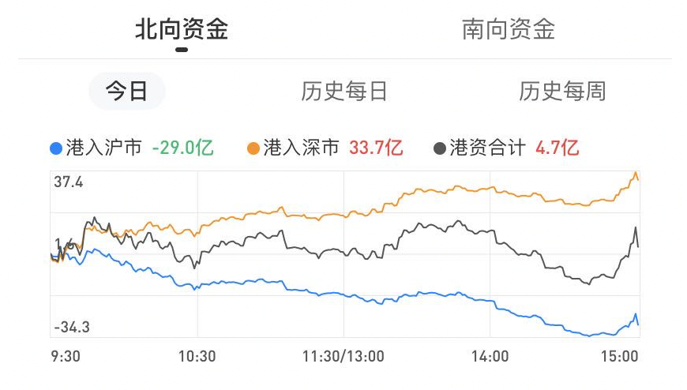

## 2020-07-28

成交量：3898.74 亿 `缩`

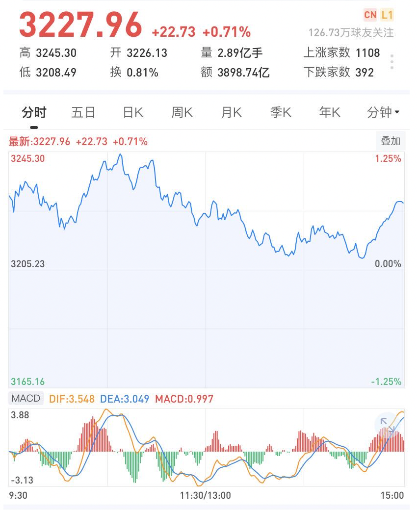

​                                        	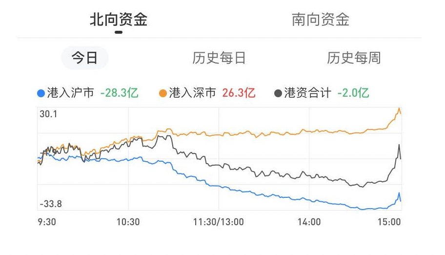

## 2020-07-29

成交量：4530.94 亿 `放`

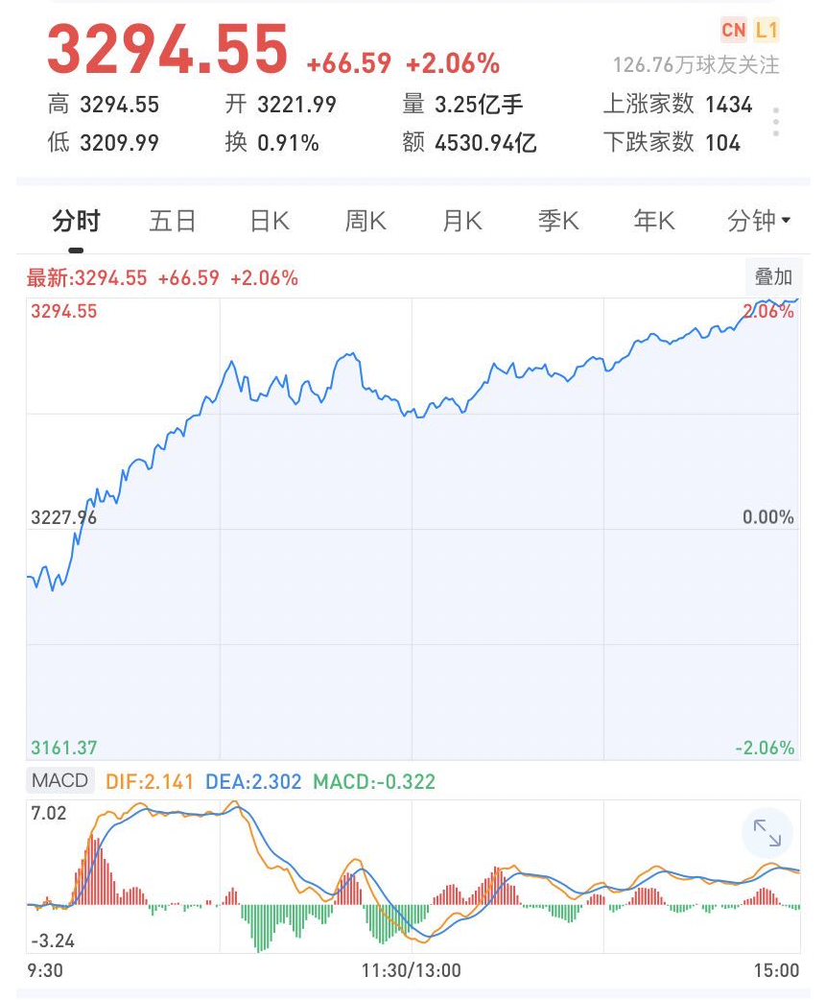

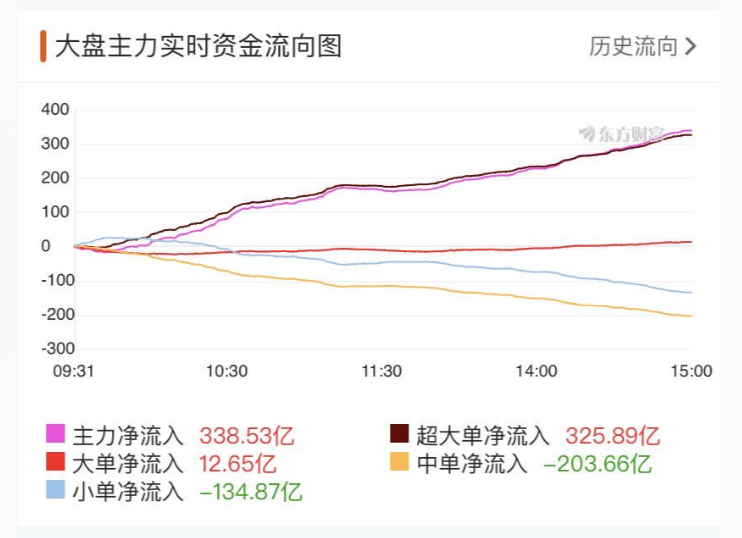

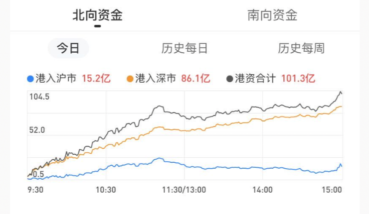

## 2020-07-30

风险指数 `70` 防守