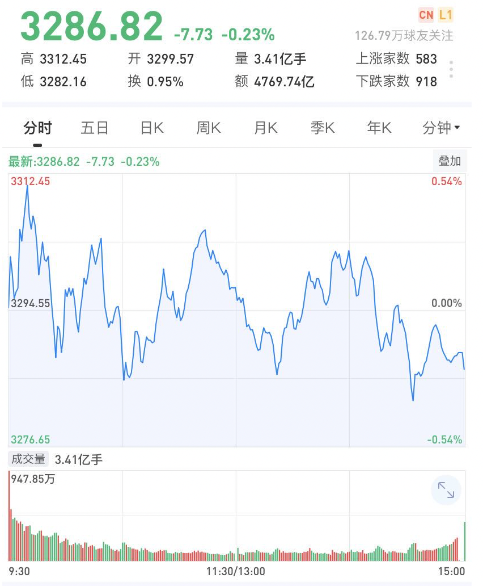

## 股票复盘

## 2020-07-20

成交量：4865亿 ->  5440 亿 `放`

## 2020-07-21

成交量：5440 -> 5405亿 `缩`

## 2020-07-22

成交量：4888-> 5405亿   `放`

复盘： 建仓吃药、喝酒、科技三个板块ETF

## 2020-07-23

成交量：5405  -> 5468 亿  `放`

事件：美国政府要求中国 72 小时内关闭驻休斯敦总领事馆（`美国目前对中国最大的利空不在这，而是再次加征关税问题。初次之外，没有什么消息可以阻止A股继续走牛的趋势`）

复盘: 主力又一次玩了一把完美洗盘，走V， 今天低点的时候应该低吸

策略: 下次如果资金流向，主力流出和小单流入量相近的时候，说明是主力在洗盘，可以在低点吸入

预测：明日冲高 3380点，如果失败减仓

总结：**即便后面大盘还要下去依然是假摔而已，这是主力的诱空手段，是要让散户割肉交出手里的筹码而已，大家要明白这里主力的手法与意图。**

---

---

## 2020-07-24

成交量:  5468  ->  5843亿 `放`

选股：

* 酒鬼酒 000799   69.12 建， 跌破 65.86 减半  跌到：65.88
* 策略：极限 `3180-3250`，强势`3300`

复盘：

* 昨天大盘出现了深V，卫大说：**V了之后，都是看多的人会多一点。他印象中四次里面，三次后面都是凉了的**

预判: 

* 下周先跌，然后企稳，指数可以稳住后慢慢加仓

总结:

* 不能跟这市场节奏走，这样会被玩死，以后要设立自己的节奏。**不满仓，低位买进，高位卖出，保持仓位**

## 2020-07-27

成交量:   `缩`

## 2020-07-28

成交量：3898.74 亿 `缩`

​                                        	

## 2020-07-29

成交量：4530.94 亿 `放`

## 2020-07-30

今天策略：风险指数 `70` 防守

成交量：4769.74 亿 `放`

总结：

* 昨日市场大涨后，次日个股分化，这是由市场环境所决定。
* 今天吃药行情很不错，大涨，涨的我清仓了。

* 震荡的一天，北向资金昨天流入100多亿做了一个短线今天跑了，多空博弈激烈，下午尾盘跳水。
* 科技和消费的长主线不会改变，阶段上则是医药。

## 2020-07-30

成交量：4957 亿 `放`

**指数想走牛需要两个条件**

**一，成交量**

**二，突破3380**

这两个不符合都不是指数走牛的表现，都是需要做波段，做t，高抛低吸的震荡行情，尤其是成交量

如果大盘后面真的突破3380，甚至突破了3400假如没有成交量，就5500亿，6000亿左右，死活上不到7000亿以上，也会跌回来的。

**北向资金**

这几天北向资金做T的手法都是，尾盘买入，第二天做T。

**总结**

今天生物科技没有低吸，在`跌`最大并且有量的时候，其实可以大胆买入。原理是，当不断下跌，散户扛不住，突然杀跌，出现批量出货的时候，绿线很高，这时候主力，会大量吃入，说明已经达到买家的预期的时候，可以抄底。

